<h1 align=center>Redux &amp; Redux Saga</h1>

Um breve resumo sobre Redux e Redux Saga.

## Sumário

1.  [Conceitos](#conceitos)
    - [Gerenciamento de estado](#gerenciamento-de-estado)
    - [Ferramentas disponíveis](#ferramentas-disponíveis)

2.  [Redux na prática](#redux-na-prática)
    - [Arquitetura flux](#arquitetura-flux)
    - [Configurando Store](#configurando-store)
    - [Usando os reducers](#usando-os-reducers)
    - [Estado inicial do Reducer](#estado-inicial-do-reducer)
    - [Criando servidor JSON](#criando-servidor-json)
    - [Trabalhando com actions](#trabalhando-com-actions)
    - [Alterando o estado](#alterando-o-estado)
    - [Tipagens no redux](#tipagens-no-redux)
    - [Utilizando Immer](#utilizando-immer)
    - [Aumentando quantidade](#aumentando-quantidade)
    - [Debugando com o Devtools](#debugando-com-o-devtools)
    - [Abstraindo item do catálogo](#abstraindo-item-do-catálogo)

3.  [Redux Saga](#redux-saga)
    - [Configurando Redux Saga](#configurando-redux-saga)
    - [Obtendo quantidade do carrinho](#obtendo-quantidade-do-carrinho)
    - [Dividindo as _actions_](#dividindo-as-actions)
    - [Finalizando checagem do estoque](#finalizando-checagem-do-estoque)
    - [Sinalizando falta de estoque](#sinalizando-falta-de-estoque)
    - [Criando action types](#criando-action-types)

# Conceitos

## Gerenciamento de estado

O _redux_ é uma biblioteca de gerenciamento de estado dentro do _react_, que pode substituir a _context api_ do próprio react, porém com uma performance superior e alguns recursos interessantes.

Vale ressaltar que, atualmente, a _context api_ provavelmente vai conseguir resolver muito bem a maior parte dos problemas quanto ao gerenciamento de estado que você tiver. Mas ainda assim é importante ter conhecimento sobre o _redux_, pois pode ser necessário no mercado de trabalho.

## Ferramentas disponíveis

- _Context api_

[https://pt-br.reactjs.org/docs/context.html](https://pt-br.reactjs.org/docs/context.html)

Primeira opção no que se refere a gerenciamento de estado, já que é do próprio react, porém para estados mais complexos pode não ser a melhor opção.

- _Redux_

[https://redux.js.org/](https://redux.js.org/)

Caso a _context api_ não dê conta, o _redux_ provavelmente é a melhor opção, permitindo o gerenciamento de estados mais complexos bem como a granulação do estado, melhorando a performance.

- MobX

[https://mobx.js.org/README.html](https://mobx.js.org/README.html)

Tem integração com o _react_, mas também com outras frameworks no front-end. O grande foco desta biblioteca é a utilização de _observers_.

- Recoil

[https://recoiljs.org/](https://recoiljs.org/)

É uma biblioteca mais recente de gerenciamento de estado, criado por uma equipe do facebook, e o grande destaque dela é a simplicidade, sendo bem mais fácil que outras bibliotecas de gerenciamento de estado.

- Zustand

[https://github.com/pmndrs/zustand](https://github.com/pmndrs/zustand)

Outra opção mais simples e recente de gerenciamento de estado.

\*Caso esteja usando _GraphQL_ as bibliotecas recomendadas para isso são: _apollo_ e _relay_, que vão gerenciar o estado de forma mais automatizada.

# Redux na prática

## Arquitetura flux

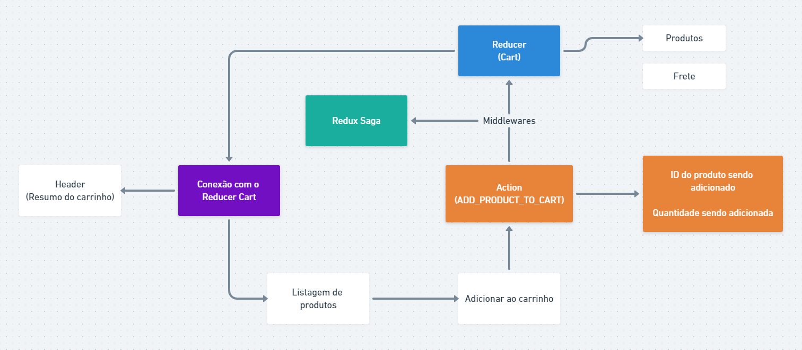

Exemplo de arquitetura de fluxo com redux.

No exemplo acima o usuário está em uma listagem de produtos e clica no botão que adiciona um produto ao seu carrinho de compras.

Isso dispara uma _action_ chamada &quot;_ADD\_PRODUCT\_TO\_CART_&quot;, que vai ser responsável por repassar qual é o ID do produto sendo adicionado bem como a quantidade sendo adicionada.

Em seguida as informações passarão pelas _middlewares_ (funções intermediárias), que vão verificar se o produto está disponível em estoque, entre outras coisas. (utilizaremos o _redux saga_ para trabalhar com as _middlewares_)

Então as informações vão chegar ao _Reducer_ que vai gerencia-las, verificando se um novo produto precisa ser adicionado ou, caso seja o mesmo produto, a quantidade precise ser a atualizada.

O _reducer_ é o responsável por manter e gerenciar essas informações.

Então a conexão com o _reducer_ vai ser avisada que houveram alterações no estado do carrinho, e vai repassar essas alterações para a listagem de produtos podendo exibir um aviso que o produto foi adicionado com sucesso, bem como o cabeçalho da aplicação onde temos um resumo do carrinho pode ter seus dados atualizados.

## Configurando Store

Agora vamos colocar a mão no código!

Crie um projeto react usando o template de typescript.

Limpe a toda a estrutura, deixando apenas um &quot;hello world&quot; sem estilização no &quot;_app.tsx_&quot;.

Agora vamos instalar o _redux_ no projeto, junto a integração dele com o react.

`yarn add redux react-redux`

Feito isso, dentro da pasta _src_ vamos criar uma pasta &quot;_store_&quot; com um arquivo _index.ts_.

Dentro dessa pasta vamos colocar tudo relacionado ao _redux_ e o estado da aplicação.

Dentro do _index.ts_, vamos criar um store o qual vai ser responsável por conter o estado global da aplicação, que em nosso caso é um _array_ vazio.

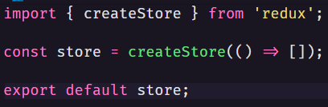

Agora no _app.tsx_, vamos importar o _Provider_ do _react-redux_ e coloca-lo em volta de toda aplicação, e passar como propriedade para ele o _store_ que acabamos de criar.

Para mostrar como acessar o estado global de outros componentes, vamos criar um componente chamado &quot;_Catalog_&quot;, e renderiza-lo no _app.tsx_.

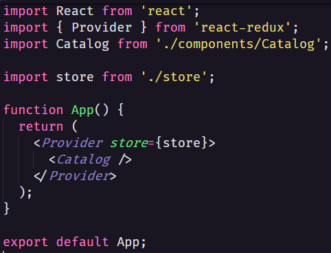

Dentro do componente de catálogo, para termos acesso ao estado global temos algumas opções:

- Utilizar o _useStore_ junto ao _getState_, para ter acesso a todo o estado da aplicação.

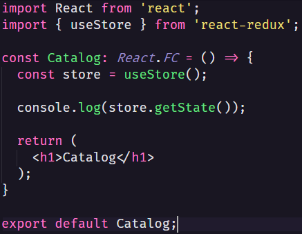

- Utilizar o _useSelector_, para ter acesso ao estado global, mas com a opção de pegar somente os dados que interessam.

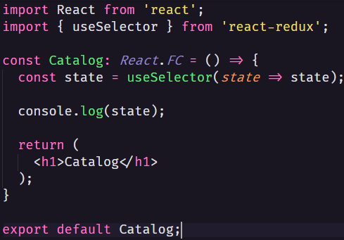

## Usando os reducers

Como dito anteriormente, uma das grandes vantagens do _redux_ em comparação a API de contexto do react, é a capacidade de dividir o estado de partes menores tornando o desempenho melhor.

Essas partes menores são chamados _reducers_, e para criar um vamos criar uma pasta _modules_ dentro da pasta _store_, e vamos criar uma pasta e um arquivo para controlar o estado do carrinho de compras do site.

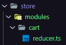

Dentro do arquivo _reducer.ts_:

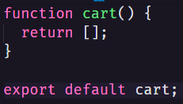

Tendo feito isso podemos importar o este _reducer_ no _index_ da pasta _store_ e retorna-lo dentro do _createStore_:

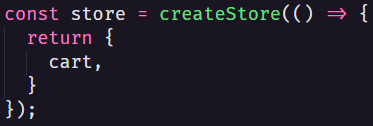

Porém, ao fazer desta forma, se fizemos o _log_ do estado global ao console o retorno do &quot;_cart_&quot; será uma função.

Então para resolvermos isso, além de unificar todos os _reducers_ em um único arquivo, vamos criar, dentro da pasta _modules_ vamos criar um arquivo _rootReducer.ts_.

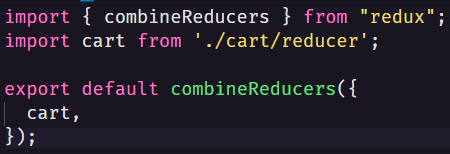

Utilizando a função _combineReducer_, vamos poder unificar todos os _reducers_ e então, no arquivo _index_ do _store_ podemos passar esse _rootReducer_ diretamente na função _createStore._

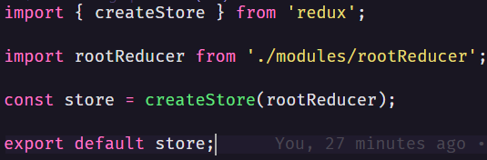

Dessa forma, teremos acesso ao estado em pequenas partes, e se fizemos um log do estado no console, poderemos ver que o _cart_ se corresponde ao um array vazio.

## Estado inicial do Reducer

Todo _reducer_ deve seguir um formato, por isso vamos definir qual é o retorno do nosso _cart reducer_, criando interfaces.

Vamos criar um novo arquivo dentro da pasta _cart_. _types.ts_

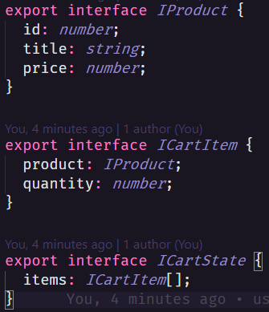

De dentro desse arquivo exportamos as interfaces que iremos utilizar, e a interface que define qual será o retorno do _cart reducer_.

Agora dentro do arquivo _reducer.ts_:

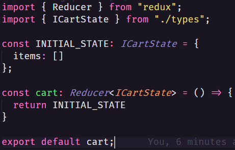

Alteramos o formato do _cart_ de uma função normal, para um _arrow function_, para podemos definir seu tipo, que no caso é: um _reducer_ que retorna um estado no formato que definimos nas interfaces. (_ICartState_)

A partir de então o _cart reducer_ precisa retornar um objeto contendo os itens do carrinho.

Como de início não teríamos nada dentro do carrinho, definimos uma constante contendo o estado inicial do carrinho e o retornamos.

## Criando servidor JSON

Para testarmos nossa aplicação, sem ter uma _api_ para fazermos consultas, utilizaremos um servidor json para simular uma _api_.

Instale: `yarn add -D json-server`

Feito isso, na raiz do projeto vamos criar um arquivo _server.json_, contendo os dados dos produtos e do estoque que vamos utilizar em nossa aplicação.

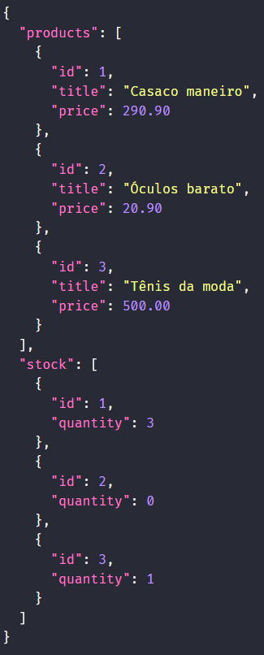

Feito isso vamos criar um _script_ para iniciar esse servidor json na porta 3333.

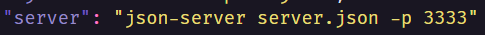

Com isso basta executar _`yarn server`_, para executar o servidor.

Para fazer as requisições para o servidor vamos utilizar o _axios_. Instalamos, criamos uma pastar _services_ e dentro um arquivo _api.ts_.

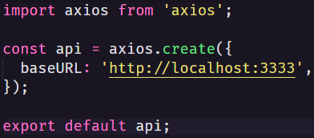

A partir daí podemos trabalhar normalmente com os dados vindos do servidor para listarmos os produtos no componente de catálogo.

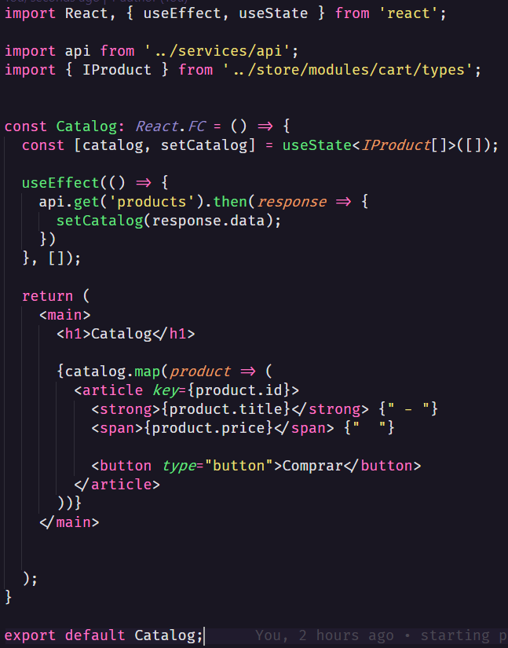

## Trabalhando com actions

Agora que dentro do componente de catálogo listamos os produtos e temos um botão de compra, precisamos que, quando o usuário clicar no botão &quot;comprar&quot;, uma _action_ seja disparada e o produto seja adicionado ao estado do carrinho de compras.

Para criar uma _action_ responsável por isso, dentro da pasta _cart_, vamos criar um arquivo _action_.ts.

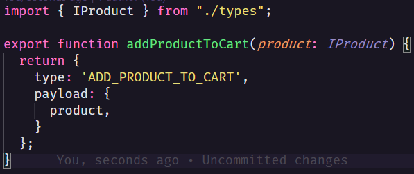

As actions são funções que devem retornar um objeto com o um &quot;_type_&quot; contendo o nome da action, o qual deve ser único e bem descritivo; e também o _payload_ que geralmente são os parâmetros recebidos pela função.

Para que o essa função seja executada no momento em que clicarmos no botão, no componente de catálogo vamos fazer o seguinte:

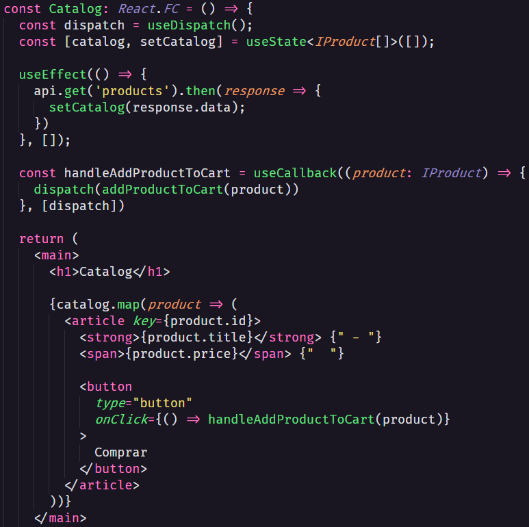

Não podemos executar diretamente a função _addProductToCart_ pois dessa maneira ela apenas retornaria o _type_ e o _payload_. Para executa-la corretamente precisamos importar o _useDispatch_ do _react-redux_.

Utilizando o _dispatch_ podemos executar a função dentro dele passando os parâmetros necessários.

Depois disso basta executar a função _handleAddProductToCart_ sempre que o botão for clicado.

Com isso de dentro do _cart reducer_ teremos acesso ao estado e a ação sendo executada, porém isso por si só não altera o estado.

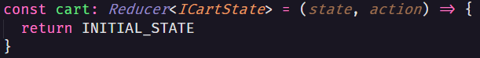

## Alterando o estado

Para que fazer alterações no estado faremos o seguinte:

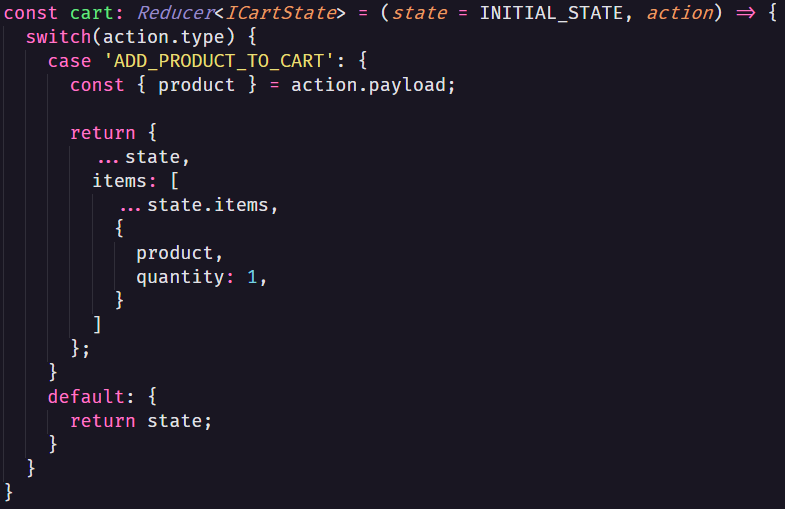

No _cart Reducer_, vamos adicionar um _switch_ para que algo seja executado com base no tipo da _action_ executada.

Todo _switch_ precisa de um comportamento _default_, que em nosso caso é retornar o estado recebido, e caso o estado não tenha sofrido nenhuma alteração, como acontece quando ele inicia, definimos o valor padrão do estado como sendo igual ao estado inicial.

Agora quando a _action_ de adicionar produto no carrinho for executada, vamos extrair o produto do _payload_ da _action_, e então retornar o estado anterior, adicionando o novo produto, sempre respeitando o conceito de imutabilidade do _react_.

## Tipagens no redux

Para retornamos as informações do estado precisamos primeiro definir o formato dessas informações.

Dentro do _index_ da pasta _store_, vamos exportar uma interface contendo o formato de nosso estado global.

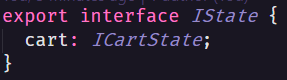

Agora vamos criar um componente de carrinho, para listar em uma tabela os produtos adicionados ao carrinho, e assim podermos ver as alterações no estado acontecendo.

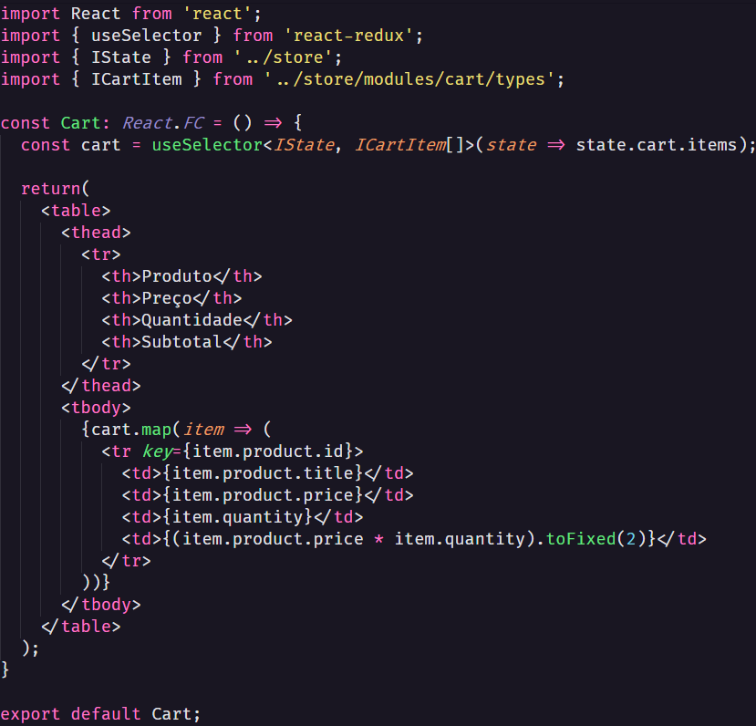

Nesse componente de carrinho, acessamos as informações do estado através do _useSelector_ como fizemos anteriormente, mas acontece que o estado retornando por esse _hook_ não tem tipagem definida, por tanto não conseguimos acessar diretamente o estado _cart_.

Para conseguirmos definir a tipagem desse estado vamos passar um _generic_ (_\&lt;\&gt;_), com o formato de nosso estado global _IState_.

Dessa forma já é possível acessarmos o estado do _cart_, mas ainda assim, a variável que contém o _hook_ não terá seu tipo definido. Para isso passamos como segundo parâmetro do _generic_ o formato que essa variável terá, que no caso é um _array_ contendo os itens do carrinho.

Com isso já temos acesso aos itens presentes no estado do carrinho, e assim vamos renderizar uma tabela com as informações dos produtos adicionados ao carrinho.

## Utilizando Immer

Vamos utilizar a biblioteca do _immer_ para aplicar a imutabilidade de maneira menos verbosa, observe.

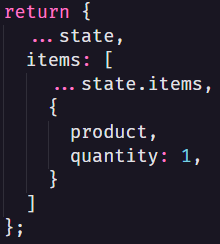

Essa é a maneira a qual atualmente aplicamos o conceito de imutabilidade, utilizamos o _spread operator_ para copiar o estado anterior e adicionamos a novas a informações.

Agora utilizando o _immer_:

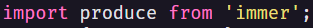

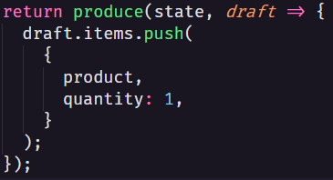

Utilizando o _immer_, passamos como primeiro parâmetro o estado anterior e como segundo parâmetro temos uma função que contém um rascunho com o mesmo formato do estado onde podemos fazer um push ao _array_ de items de maneira tradicional, que o _immer_ vai se encarregar de aplicar o conceito de imutabilidade.

Com isso já diminuímos bastante a verbosidade ao adicionar um item ao estado, mas acontece que todas as _actions_ vão ter um _return_ alterando o estado com base no estado anterior, então para evitar a repetição de código vamos fazer o seguinte:

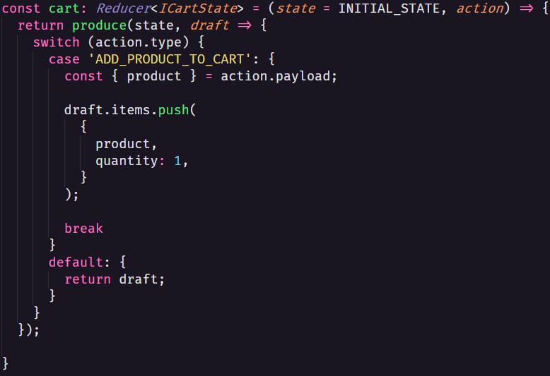

Colocamos o _return_ na primeira linha e agora ao invés de cada _case_ do _switch_ retornar uma alteração no estado, eles vão fazer uma alteração no rascunho do estado.

## Aumentando quantidade

Atualmente mesmo que o produto já esteja no carrinho, quando clicamos no botão comprar, ele é adicionado novamente ao carrinho.

Queremos alterar esse comportamento para: quando um produto que já está no carrinho for adicionado novamente, a quantidade desse produto no carrinho deve ser aumentada em + 1.

Para fazermos isso adicionamos o seguinte trecho de código:

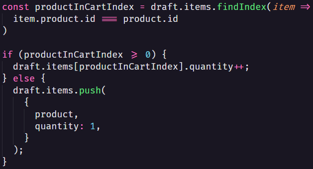

Primeiro procuramos o index do produto adicionado no _array_ de items já presente no estado e então se houver algum produto no estado com o mesmo ID do produto adicionado, seu index será retornado, do contrário será retornado -1.

Então fazemos uma verificação. Se o index do produto no carrinho for maior ou igual a zero, ou seja, caso o produto já esteja presente no estado, vamos apenas incrementar sua quantidade em mais 1.

Caso contrário, adicionamos um novo item no array.

## Debugando com o Devtools

Para debugar aplicação que utiliza _redux_, vamos utilizar a extensão do navegador:

[https://chrome.google.com/webstore/detail/redux-devtools/lmhkpmbekcpmknklioeibfkpmmfibljd/related?hl=pt-BR](https://chrome.google.com/webstore/detail/redux-devtools/lmhkpmbekcpmknklioeibfkpmmfibljd/related?hl=pt-BR)

E então instalar no projeto:

`yarn add redux-devtools-extension`

Agora no arquivo _index_ da pasta _store_:

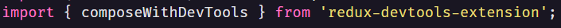

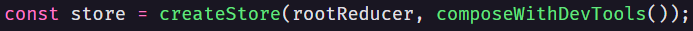

Importamos a função _composeWithDevTools_, e a executamos como segundo parâmetro do _createStore._

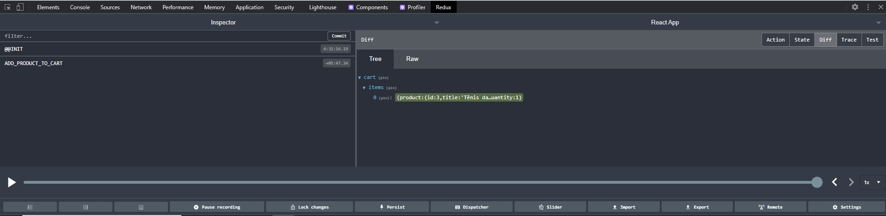

Dessa forma em seu navegador é possível acessar o _devtools_ e ter acesso a todas as actions que forem executadas bem como mudanças que elas acarretarem no estado.

## Abstraindo item do catálogo

Vamos abstrair o item do catálogo em um novo componente.

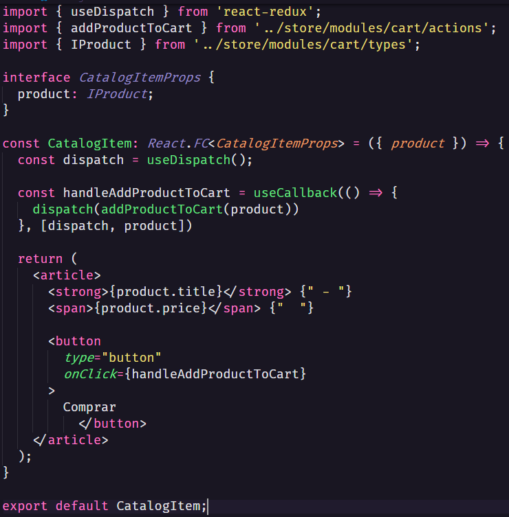

Nesse novo componente recebemos o produto como propriedade do componente e então movemos todo _html_ dos itens do catalogo para dentro do _return_ desse componente.

Movemos também a função _handleAddProductToCart_, e então podemos tirar o _product_ como parâmetro desta função, já que o product está disponível em todo componente através das _props_.

Então fazemos todas as devidas importações.

Agora no componente de catalogo o código ficou assim:

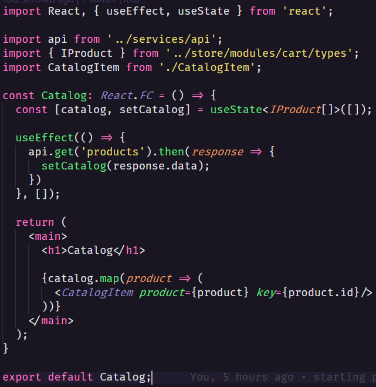

# Redux Saga

É um _middleware_, ou seja, uma função intermediária, que é executada entre o disparo da _action_ e o reducer.

## Configurando Redux Saga

Instale o _redux saga_ no projeto:

`yarn add redux-saga`

Feito isso, dentro do index da pasta _store_, vamos fazer o seguinte:

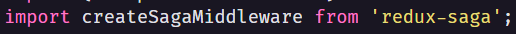

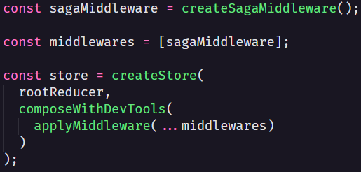

1. Importamos o _export default_ do _redux saga_, como sendo _createSagaMiddleware;_
2. Instanciamos esta função em uma variável chamada _saggaMiddleware_;
3. Criamos uma variável _middlewares_ contendo um _array com as middlewares_, que temos (no caso, apenas a _sagaMiddleware_);
4. Agora dentro da função _createStore,_ como argumento da função _composeWithDevTools_, colocamos a função _applyMiddleware_ (importada do _redux_), e como parâmetro para esta função passamos todos os itens dentro do _array_ de _middlewares_.

Agora dentro da pasta _cart_, vamos criar um arquivo _sagas.ts_:

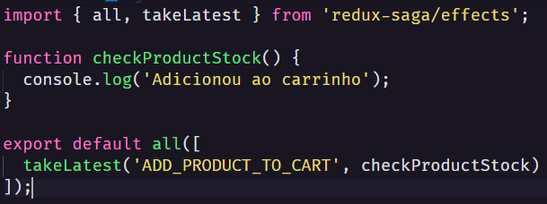

Dentro deste arquivo, vamos criar as _middlewares_.

Em nosso caso, queremos uma _middleware_ responsável por verificar o estoque do produto que vai ser adicionado ao carrinho.

Para isso criamos uma função que checa o estoque, mas que por enquanto vai apenas fazer um _log_ ao console dizendo &quot;Adicionou ao carrinho&quot;.

E então desse arquivo vamos exportar o método _all_ que importamos do _redux-saga/effects_, contendo como parâmetro um _array_ e dentro deste, colocamos o método _takeLatest_, que vai pegar a ultima chamada a uma _action_, em nosso caso &quot;_ADD\_PRODUCT\_TO\_CART_&quot;, e executar a função que definimos, _checkProductStock_.

Feito isso, dentro da pasta _modules_, vamos criar um arquivo _rootSaga.ts_:

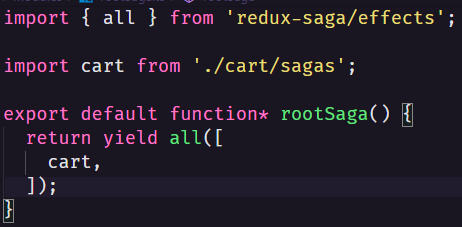

Dentro dele vamos conter todas nossas _middlewares_.

Então exportamos um _generator function_ (resumidamente uma função assíncrona) chamada _rootSaga_ que retorna todas as nossa _middlewares_, que em nosso caso é apenas as _middlewares_ do _cart_.

Feito isso, importamos o _rootSaga_ dentro do arquivo _indext_ da pasta _store_, e adicionamos a seguinte linha:

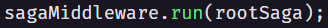

Feito isso, tudo ainda deve estar funcionando normalmente na aplicação, com exceção de que sempre que o botão &quot;comprar&quot; for clicado e a _action_ de adicionar produtos ao carrinho for disparada, o _middleware_ que criamos vai fazer um _log_ no _console_ que algo foi adicionado ao carrinho.

## Obtendo quantidade do carrinho

Para verificar se o produto está disponível no estoque, primeiro temos que ter acesso a quantidade de produtos no carrinho, para fazer a verificação.

Para isso vamos fazer o seguinte dentro do arquivo _sagas.ts_:

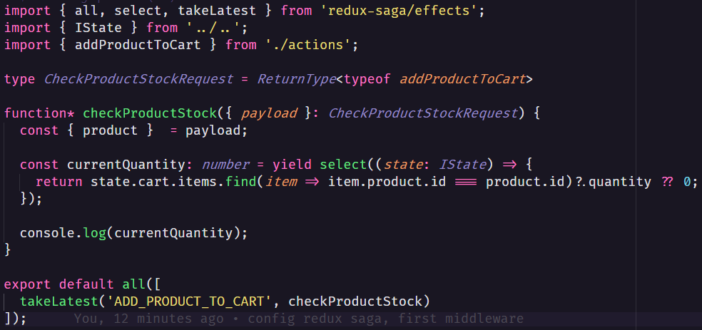

Vamos transformar a função _checkProductStock_ em uma _generator function_. Esta função vai receber uma _action_ como parâmetro, mas precisamos definir esse tipo antes.

Criamos um _type_ do _typescript_, chamado _CheckProductStockRequest_ que é igual ao tipo de retorno (_ReturnType_) da função _addProductToCart_, que importamos do arquivo _actions_.

Como esse _type_ pronto, definimos o argumento como sendo desse tipo, e então teremos acesso as propriedades do _action_.

Então de dentro do _payload_ da _action_ extraímos o produto para termos acesso ao seu ID.

Agora criamos uma variável para conter o número atual do produto no carrinho (Utilizamos o _yield_ já que se trada de um processo assíncrono). E utilizamos a função _select_ do _redux-saga_, que recebe um _callback function_ que por sua vez recebe o estado que é do tipo _IState_, e retorna uma procura pela quantidade do produto com o mesmo ID do produto que recebemos no _payload_ da _action_ nesse estado.

Caso tenho alguma unidade do produto especificado no estado, então essa quantidade será retornada, do contrário será retornado 0.

## Dividindo as _actions_

Nós adicionamos um _middleware_ que faz um log ao console sobre a quantidade do produto no estado do carrinho, mas o real objetivo deste _middleware_ é verificar se o produto está ou não disponível em estoque para que a quantidade aumente ou não.

Observe que atualmente, independente do que essa _middlware_ faça, o produto continua sendo adicionado ao carrinho e sua quantidade aumentada. Para que o produto seja adicionado ou a quantidade seja aumentada somente se o produto estiver disponível em estoque vamos começar dividindo as _actions_ do _cart_.

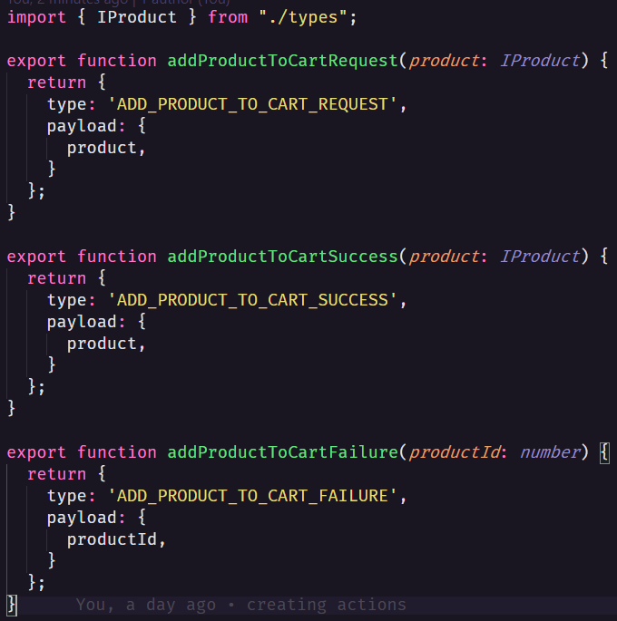

Agora temos um _action_ que disparada quando a requisição de adição de produto é feita, outra _action_ para quando houver sucesso e o produto puder ser adicionado ao carrinho e por fim uma _action_ para quando não for possível adicionar o produto ao carrinho.

\*na _action_ de falha, não precisamos de todas informações do produto, por isso alteramos seus parâmetros e seu _payload_ para somente o ID do produto.

Feito isso precisamos alterar o componente _catalogItem_, para disparar a _action_ de requisição:

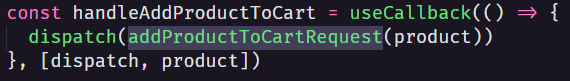

Dentro do arquivo _sagas.ts_, também vamos alterar para:

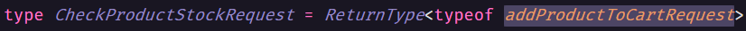

Agora dentro do _reducer_ do _cart_, vamos alterar para que o produto seja adicionado ao carrinho somente se a _action_ de sucesso for disparada.

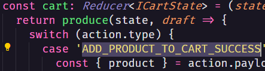

## Finalizando checagem do estoque

Para fazer a checagem de estoque faremos o seguinte:

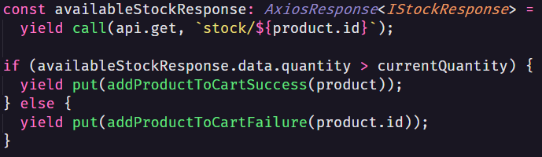

Dentro da função _checkProductStock_, vamos fazer uma requisição a _api_, para verificar a quantidade do produto em estoque.

Dentro desta função não podemos fazer diretamente uma requisição a _api_ com o _axios_, para executar uma função assíncrona precisamos utilizar o método _call_ do _redux-saga/effects_.

Dentro do método _call_, passamos a função que vai ser executada e como segundo parâmetro passamos com que argumento ela vai ser executada, que no caso é a rota da api que busca o estoque de um produto com um ID específico.

Armazenamos o resultado desta requisição dentro de uma variável, mas precisaremos definir o formato desta variável, que no caso é um _AxiosResponse_, que retorna um _IStockResponse_.

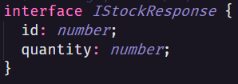

Com o resultado da quantidade do produto em estoque podemos fazer uma comparação: se a quantidade do produto em estoque for maior que a quantidade atual do produto no carrinho então podemos executar a _action_ de sucesso. Do contrário executamos a _action_ de falha.

\*utilizamos o _put_ para executar uma _action_ dentro desta _middleware_ do _redux-saga_.

Por fim, dentro do _reducer_ também vamos adicionar um _case_ para caso a _action_ de falha seja disparada.

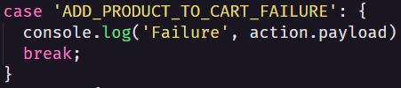

## Sinalizando falta de estoque

Para exibirmos na interface que o produto está em falta no estoque precisamos adicionar essa informação ao nosso estado.

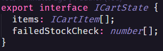

Dentro do arquivo _types.ts_ no _ICartState_, vamos adicionar um novo item ao estado, um _array_ de IDs dos produtos que falharam na checagem de estoque.

Então dentro do _reducer_, quando a _action_ de falha ao adicionar ao carrinho for disparada, adicionaremos o ID do produto ao estado.

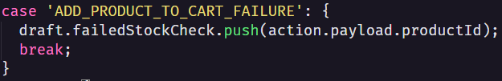

Agora na nossa interface, dentro do componente _CatalogItem_, vamos fazer o seguinte:

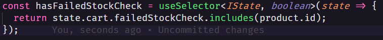

Adicionamos uma variável que vai utilizar o _useSelector_ para acessar o estado, e verificar se o ID do produto, que está sendo exibido pelo _CatalogItem,_ está presente no _array_ de _IDs_ de produtos que falharam na checagem de estoque e retornar um _boolean_.

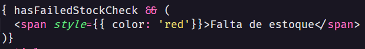

Com base nesse _boolean_ exibimos ou não em tela a frase &quot;falta de estoque&quot; em vermelho.

## Criando action types

Dentro do arquivo _types.ts_ vamos criar um _enum_ para poder abstrair o nome das _actions_ em um único arquivo.

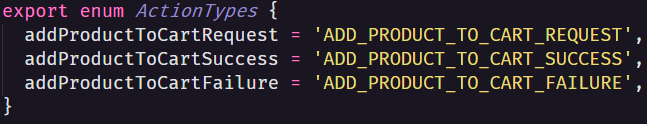

Dessa forma poderemos, em todos os arquivos que tem o nome de uma _action_, fazer da seguinte forma:

\*Os arquivos que deverão ser alterados são: _actions.ts, sagas.ts_ e _reducer.ts._